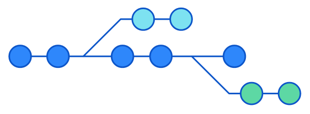

# Git 原理入门

作者： [阮一峰](http://www.ruanyifeng.com/)

日期： [2018年10月10日](http://www.ruanyifeng.com/blog/2018/10/)


即使天天使用它，很多人也未必了解它的原理。Git 为什么可以管理版本？`git add`、`git commit`这些[基本命令](http://www.ruanyifeng.com/blog/2015/12/git-cheat-sheet.html)，到底在做什么，你说得清楚吗？

这篇文章用一个实例，解释 Git 的运行过程，帮助你理解 Git 的原理。



## 一、初始化

首先，让我们创建一个项目目录，并进入该目录。

```bash
$ mkdir git-demo-project
$ cd git-demo-project
```

我们打算对该项目进行版本管理，第一件事就是使用`git init`命令，进行初始化。

```bash
$ git init
```

`git init`命令只做一件事，就是在项目根目录下创建一个`.git`子目录，用来保存版本信息。

```bash
$ ls .git
 
branches/
config
description
HEAD
hooks/
info/
objects/
refs/
```

上面命令显示，`.git`内部还有一些子目录，这里先不解释它们的含义。

## 二、保存对象

接下来，新建一个空文件`test.txt`。

```bash
$ touch test.txt
```

然后，把这个文件加入 Git 仓库，也就是为`test.txt`的当前内容创建一个副本。

```bash
$ git hash-object -w test.txt
 
e69de29bb2d1d6434b8b29ae775ad8c2e48c5391
```

上面代码中，`git hash-object`命令把`test.txt`的当前内容压缩成二进制文件，存入 Git。压缩后的二进制文件，称为一个 Git 对象，保存在`.git/objects`目录。

这个命令还会计算当前内容的 SHA1 哈希值（长度40的字符串），作为该对象的文件名。下面看一下这个新生成的 Git 对象文件。

```bash
$ ls -R .git/objects
 
.git/objects/e6:
9de29bb2d1d6434b8b29ae775ad8c2e48c5391
```

上面代码可以看到，`.git/objects`下面多了一个子目录，目录名是哈希值的前2个字符，该子目录下面有一个文件，文件名是哈希值的后38个字符。

再看一下这个文件的内容。

```bash
$ cat .git/objects/e6/9de29bb2d1d6434b8b29ae775ad8c2e48c5391
```

上面代码输出的文件内容，都是一些二进制字符。你可能会问，`test.txt`是一个空文件，为什么会有内容？这是因为二进制对象里面还保存一些元数据。

如果想看该文件原始的文本内容，要用`git cat-file`命令。

```bash
$ git cat-file -p e69de29bb2d1d6434b8b29ae775ad8c2e48c5391
```

因为原始文件是空文件，所以上面的命令什么也看不到。现在向`test.txt`写入一些内容。

```bash
$ echo 'hello world' > test.txt
```

因为文件内容已经改变，需要将它再次保存成 Git 对象。

```bash
$ git hash-object -w test.txt

3b18e512dba79e4c8300dd08aeb37f8e728b8dad
```

上面代码可以看到，随着内容改变，`test.txt`的哈希值已经变了。同时，新文件`.git/objects/3b/18e512dba79e4c8300dd08aeb37f8e728b8dad`也已经生成了。现在可以看到文件内容了。

```bash
$ git cat-file -p 3b18e512dba79e4c8300dd08aeb37f8e728b8dad

hello world
```

## 三、暂存区

文件保存成二进制对象以后，还需要通知 Git 哪些文件发生了变动。所有变动的文件，Git 都记录在一个区域，叫做"暂存区"（英文叫做 index 或者 stage）。等到变动告一段落，再统一把暂存区里面的文件写入正式的版本历史。

`git update-index`命令用于在暂存区记录一个发生变动的文件。

```bash
$ git update-index --add --cacheinfo 100644 \
3b18e512dba79e4c8300dd08aeb37f8e728b8dad test.txt
```

上面命令向暂存区写入文件名`test.txt`、二进制对象名（哈希值）和文件权限。

`git ls-files`命令可以显示暂存区当前的内容。

```bash
$ git ls-files --stage

100644 3b18e512dba79e4c8300dd08aeb37f8e728b8dad 0   test.txt
```

上面代码表示，暂存区现在只有一个文件`test.txt`，以及它的二进制对象名和权限。知道了二进制对象名，就可以在`.git/objects`子目录里面读出这个文件的内容。

`git status`命令会产生更可读的结果。

```bash
$ git status
 
要提交的变更：
    新文件：   test.txt
```

上面代码表示，暂存区里面只有一个新文件`test.txt`，等待写入历史。

## 四、git add 命令

上面两步（保存对象和更新暂存区），如果每个文件都做一遍，那是很麻烦的。Git 提供了`git add`命令简化操作。

```bash
$ git add --all
```

上面命令相当于，对当前项目所有变动的文件，执行前面的两步操作。

## 五、commit 的概念

暂存区保留本次变动的文件信息，等到修改了差不多了，就要把这些信息写入历史，这就相当于生成了当前项目的一个快照（snapshot）。

项目的历史就是由不同时点的快照构成。Git 可以将项目恢复到任意一个快照。快照在 Git 里面有一个专门名词，叫做 commit，生成快照又称为完成一次提交。

下文所有提到"快照"的地方，指的就是 commit。

## 六、完成提交

首先，设置一下用户名和 Email，保存快照的时候，会记录是谁提交的。

```bash
$ git config user.name "用户名" 
$ git config user.email "Email 地址"
```

接下来，要保存当前的目录结构。前面保存对象的时候，只是保存单个文件，并没有记录文件之间的目录关系（哪个文件在哪里）。

`git write-tree`命令用来将当前的目录结构，生成一个 Git 对象。

```bash
$ git write-tree

c3b8bb102afeca86037d5b5dd89ceeb0090eae9d
```

上面代码中，目录结构也是作为二进制对象保存的，也保存在`.git/objects`目录里面，对象名就是哈希值。

让我们看一下这个文件的内容。

```bash
$ git cat-file -p c3b8bb102afeca86037d5b5dd89ceeb0090eae9d
 
100644 blob 3b18e512dba79e4c8300dd08aeb37f8e728b8dad    test.txt
```

可以看到，当前的目录里面只有一个`test.txt`文件。

所谓快照，就是保存当前的目录结构，以及每个文件对应的二进制对象。上一个操作，目录结构已经保存好了，现在需要将这个目录结构与一些元数据一起写入版本历史。

`git commit-tree`命令用于将目录树对象写入版本历史。

```bash
$ echo "first commit" | git commit-tree c3b8bb102afeca86037d5b5dd89ceeb0090eae9d
 
c9053865e9dff393fd2f7a92a18f9bd7f2caa7fa
```

上面代码中，提交的时候需要有提交说明，`echo "first commit"`就是给出提交说明。然后，`git commit-tree`命令将元数据和目录树，一起生成一个 Git 对象。现在，看一下这个对象的内容。

```bash
$ git cat-file -p c9053865e9dff393fd2f7a92a18f9bd7f2caa7fa
 
tree c3b8bb102afeca86037d5b5dd89ceeb0090eae9d
author ruanyf  1538889134 +0800
committer ruanyf  1538889134 +0800

first commit
```

上面代码中，输出结果的第一行是本次快照对应的目录树对象（tree），第二行和第三行是作者和提交人信息，最后是提交说明。

`git log`命令也可以用来查看某个快照信息。

```bash
$ git log --stat c9053865e9dff393fd2f7a92a18f9bd7f2caa7fa
 
commit c9053865e9dff393fd2f7a92a18f9bd7f2caa7fa
Author: ruanyf 
Date:   Sun Oct 7 13:12:14 2018 +0800

    first commit

 test.txt | 1 +
 1 file changed, 1 insertion(+)
```

## 七、git commit 命令

Git 提供了`git commit`命令，简化提交操作。保存进暂存区以后，只要`git commit`一个命令，就同时提交目录结构和说明，生成快照。

```bash
$ git commit -m "first commit"
```

此外，还有两个命令也很有用。

`git checkout`命令用于切换到某个快照。

```bash
$ git checkout c9053865e9dff393fd2f7a92a18f9bd7f2caa7fa
```

`git show`命令用于展示某个快照的所有代码变动。

```bash
$ git show c9053865e9dff393fd2f7a92a18f9bd7f2caa7fa
```

## 八、branch 的概念

到了这一步，还没完。如果这时用`git log`命令查看整个版本历史，你看不到新生成的快照。

```bash
$ git log
```

上面命令没有任何输出，这是为什么呢？快照明明已经写入历史了。

原来`git log`命令只显示当前分支的变动，虽然我们前面已经提交了快照，但是还没有记录这个快照属于哪个分支。

所谓分支（branch）就是指向某个快照的指针，分支名就是指针名。哈希值是无法记忆的，分支使得用户可以为快照起别名。而且，分支会自动更新，如果当前分支有新的快照，指针就会自动指向它。比如，master 分支就是有一个叫做 master 指针，它指向的快照就是 master 分支的当前快照。

用户可以对任意快照新建指针。比如，新建一个 fix-typo 分支，就是创建一个叫做 fix-typo 的指针，指向某个快照。所以，Git 新建分支特别容易，成本极低。

Git 有一个特殊指针`HEAD`， 总是指向当前分支的最近一次快照。另外，Git 还提供简写方式，`HEAD^`指向 `HEAD`的前一个快照（父节点），`HEAD~6`则是`HEAD`之前的第6个快照。

每一个分支指针都是一个文本文件，保存在`.git/refs/heads/`目录，该文件的内容就是它所指向的快照的二进制对象名（哈希值）。

## 九、更新分支

下面演示更新分支是怎么回事。首先，修改一下`test.txt`。

```bash
$ echo "hello world again" > test.txt
```

然后，保存二进制对象。

```bash
$ git hash-object -w test.txt

c90c5155ccd6661aed956510f5bd57828eec9ddb
```

接着，将这个对象写入暂存区，并保存目录结构。

```bash
$ git update-index test.txt
$ git write-tree

1552fd52bc14497c11313aa91547255c95728f37
```

最后，提交目录结构，生成一个快照。

```bash
$ echo "second commit" | git commit-tree 1552fd52bc14497c11313aa91547255c95728f37 -p c9053865e9dff393fd2f7a92a18f9bd7f2caa7fa

785f188674ef3c6ddc5b516307884e1d551f53ca
```

上面代码中，`git commit-tree`的`-p`参数用来指定父节点，也就是本次快照所基于的快照。

现在，我们把本次快照的哈希值，写入`.git/refs/heads/master`文件，这样就使得`master`指针指向这个快照。

```bash
$ echo 785f188674ef3c6ddc5b516307884e1d551f53ca > .git/refs/heads/master
```

现在，`git log`就可以看到两个快照了。

```bash
$ git log

commit 785f188674ef3c6ddc5b516307884e1d551f53ca (HEAD -> master)
Author: ruanyf 
Date:   Sun Oct 7 13:38:00 2018 +0800

 second commit

commit c9053865e9dff393fd2f7a92a18f9bd7f2caa7fa
Author: ruanyf 
Date:   Sun Oct 7 13:12:14 2018 +0800

 first commit
```


`git log`的运行过程是这样的：

> 1. 查找`HEAD`指针对应的分支，本例是`master`
> 2. 找到`master`指针指向的快照，本例是`785f188674ef3c6ddc5b516307884e1d551f53ca`
> 3. 找到父节点（前一个快照）`c9053865e9dff393fd2f7a92a18f9bd7f2caa7fa`
> 4. 以此类推，显示当前分支的所有快照

最后，补充一点。前面说过，分支指针是动态的。原因在于，下面三个命令会自动改写分支指针。

> - `git commit`：当前分支指针移向新创建的快照。
> - `git pull`：当前分支与远程分支合并后，指针指向新创建的快照。
> - `git reset [commit_sha]`：当前分支指针重置为指定快照。

## 十、参考链接

- [How does git work internally](https://medium.com/@shalithasuranga/how-does-git-work-internally-7c36dcb1f2cf), Shalitha Suranga

（完）

### 文档信息

- 版权声明：自由转载-非商用-非衍生-保持署名（[创意共享3.0许可证](http://creativecommons.org/licenses/by-nc-nd/3.0/deed.zh)）
- 发表日期： 2018年10月10日